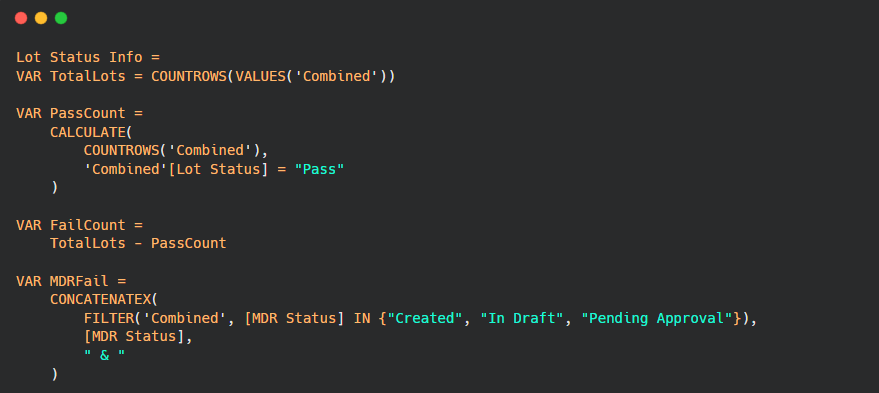

# 📋 Quality Control Dashboard (Power BI)

## 📌 Overview
I built this dashboard to streamline the **lot-status verification** process for the Quality Assurance (QA) team. QA engineers previously cross-checked multiple internal systems for every production lot—a manual, time-consuming, and error-prone task.

Using **SQL**, I extracted production data from an on-premise **Teradata** warehouse, and **imported multidimensional data directly from SQL Server Analysis Services (SSAS)** into Power BI. The result was a centralized, interactive report that enabled faster and more reliable decisions at the QA gate.

---

## 🔐 Confidentiality Note
*All data in this dashboard has been recreated or anonymized to protect company confidentiality. This sample only reflects the data logic and structure used in the actual project.*

---

## 🎯 Problem Statement
QA engineers needed to verify lot readiness by checking status across **3 different systems** (MDR, I8D, and CMT), leading to:
- Delays in lot approval and shipment
- Inconsistent decision-making due to manual tracking
- Risk of human error in critical quality checks

---

## ✅ Solution
The **E-QC Dashboard** addresses these issues by:
- 📥 **Combining** data from Teradata (via SQL) and SSAS (via direct import)
- ⚙️ Applying **automated DAX logic** to classify lot status (pass / fail)
- 🧭 Providing a **single interface** for real-time QA review
- 🟢 **Eliminating** multiple manual system checks

---

## 🛠 Tools & Technologies

| Tool | Purpose |
|------|---------|
| **Power BI** | Dashboard design & data visualization |
| **SQL** | Data extraction from production tables |
| **Power Query** | Data transformation & model building |
| **DAX** | Business logic for lot status calculation |

---

## 🧭 Project Walkthrough

### 🔍 Step 1: Dashboard Preview
This Power BI dashboard provides a centralized interface for QA engineers to validate production lot status across MDR, I8D, and CMT systems.

  

*Anonymized data used for confidentiality.*

---

### 🗄️ Step 2: Data Extraction Using SQL
To retrieve lot-level data, I used **SQL** to pull and consolidate records from **Teradata** tables. The logic includes conditional handling and regex to extract valid lot numbers from various fields.

  

*Sample of the SQL logic used to retrieve and standardize lot data across systems.*  
🔗 [View full SQL logic](sql-query.sql)

---

### 🧠 Step 3: Business Logic with DAX
Once the data was loaded into Power BI, I established relationships between relevant tables. Then, using **DAX**, I built logic to automate the pass/fail decision process based on status fields from connected systems — ensuring real-time, consistent evaluations.

  

*Snippet above shows a DAX measure that determines lot status based on MDR and I8D conditions.*  
🔗 [View full DAX logic](dax-logic.txt)

---

### ✅ Step 4: Pass/Fail Scenario Example
Below is an example scenario where a lot is marked as "Pass" or "Fail" based on backend logic. Visual cues enable the QA team to act quickly and confidently.

  

*Example demonstrating dynamic decision logic using integrated backend statuses.*

---

## 🔍 Key Features

- 🧠 Automated Lot Evaluation Logic
- 📊 Centralized QA Dashboard
- ✂️ Reduced Manual QA Checks
- 🔄 Ready for scheduled refresh (via gateway, internal setup)

---

## 📈 Impact
- Reduced manual verification steps by ~30%
- Enabled faster, more accurate QA decisions
- Unified multiple system checks into one interface
- Improved consistency in lot evaluation process

---

## 🙋‍♀️ About Me
I’m a Computer Science graduate passionate about **data analytics and automation**. I use tools like Power BI, SQL, and Python to turn raw data into insights and help businesses make better decisions.

[🔗 LinkedIn](https://www.linkedin.com/in/ainamardhiah2107/)
